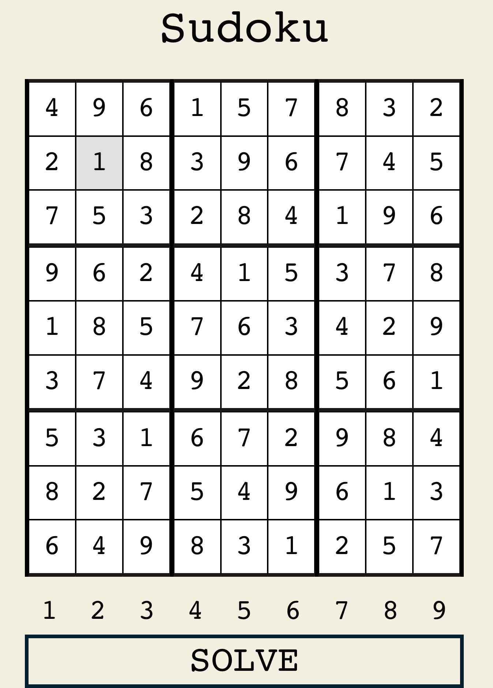

# Sudoku Solver
A sudoku solver written in typescript using backtracking.

## Demo
Check it out for yourself [here](https://aravindvasudev.github.io/sudoku-solver/).

## Contribute
You are always welcome to open an issue or provide a pull-request!

## License
Built under [MIT](./LICENSE) license.